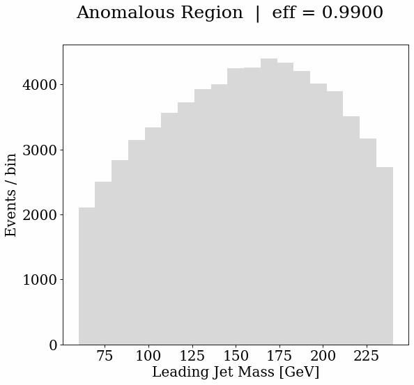

# Searching for Anomalies with Foundation Models Official Repository

In this repository you will be able to reproduce all the resuls presented in the paper based on multiple Jupyter Notebooks

```
@article{Mikuni:2026ced,
    author = "Mikuni, Vinicius and Nachman, Benjamin",
    title = "{Searching for Anomalies with Foundation Models}",
    eprint = "2603.23593",
    archivePrefix = "arXiv",
    primaryClass = "hep-ex",
    month = "3",
    year = "2026"
}
```




## Installation

```bash
pip install -r requirements.txt
```

In addition to the basic python libraries you will also need to install the Higgs Combine toolfrom the [official page](https://cms-analysis.github.io/HiggsAnalysis-CombinedLimit/latest/) to perform the fit and statistical analysis.


## Data

We provide npz files containing all the necessary information for both data and simulated processes used in this work available from [Zenodo](https://doi.org/10.5281/zenodo.19181048)


## Creating Datacards

The first step of the workflow is to process the files and save the relevant histograms to be used for the fit. The notebook ```make_datacards.ipynb``` shows how to define the observable of interest and analysis-specific choices.

## Running the fit

The binned maximum likelihood fit requires the Higgs Combine tool, which will also be used to estimate the Asymptotic Significance given the signal of interest and to create the postfit plots. After saving the relevant datacards and root file you can the script

```bash
chmod u+x run_fit.sh
./run_fit.sh --type [pred_type] --size [size] --obs [observable] --tag [tag]
```

where the options pred_type, size, observable, and tag should match the options used in the ```make_datacards``` notebook.

## Plotting the Results

After the fit is done, combine will create a root file containing the results of the postfit distributions. We can plot these results using the notebook ```plot_postfit.ipynb``` and setting all the relevant options to match the ones used to create the datacards

## ABCD Check

You can check the validity of the ABCD estimation of the QCD background by running the notebook ```check_abcd.ipynb``` which will use QCD simulated events to compare the ABCD estimation and the actual distribution


## GOF test

We also provide scripts to check the Goodness-of-fit test for the fit in the shell script ```run_gof.sh```

```bash
chmod u+x run_fit.sh
./run_gof.sh --type [pred_type] --size [size] --obs [observable] --tag [tag]
```

using the same options as before. Notice that we only evaluate the GOF results in the anomalous regions, since the other regions agree with data by default. Depending on the choice of fit regions you have to adjust the ```FIT_MASKS``` and ```EVAL_MASKS``` to be consistent with the channel names used in the datacards.


